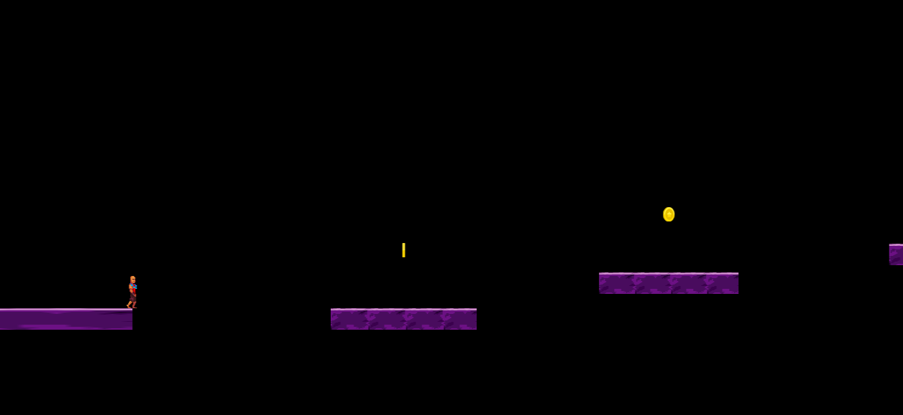

# platform-game

A platform game created in phaser 3 for Microverse's JS capstone project

## Built With:

- Javascript
- Webpack
- Phaser 3
- Jest

## screenshots

## Author

👤 **Tendongze Godson**

- Github: [tGodson](https://github.com/tGodson)
- Twitter: [@tendongze95](https://twitter.com/tendongze95)
- Linkedin: [linkedin](https://www.linkedin.com/in/tendongzegodson)

# Getting started

Don't Know where to start? Peek into this entry-level tutorials: 
 - [Using the Windows command line](https://youtu.be/MBBWVgE0ewk)
 - [Basic GIT](http://rogerdudler.github.io/git-guide/)
 - [Install NPM](https://www.npmjs.com/get-npm)

## How to install the game locally 

- Fork/Clone this project to your local machine with the command `git clone https://github.com/tGodson/platform-game.git`
- `cd` into the project directory
-  Open the terminal in your project directory
-  Make sure you have node installed
-  Run `npm install` on the terminal
-  Run `npm run dev` to open the game on the browser

## Game Instructions 
 - Click to jump between platforms. In easy mode, you can jump 3 consecutive times, 2 times in hard mode. 
 - Collect coins to gain points. 10 points per coin in easy mode, 25 points per coin in hard mode.
 - Avoid the firebombs. You lose 20 points per firebomb activated. 

## Play Live Version Without installing anything!
  - [Live version in Github Pages](http://tGodson.github.io/platform-game)

## Acknowledgments

- [Microverse](https://www.microverse.org/)
- [The Odin Project](https://www.theodinproject.com)

## Game Dev and Design

- Concept: A gothic platform game reinterpreting the classic Orpheo and Euridice Myth
- The game is built using Phaser library

## Final Game idea
 - An endless level. Orpheo hopes to reach the underworld, but it is impossible. He must find a way to deal with the grieve of losing Euridice, no way around it. 
 - Orpheo must jump between platforms to avoid chasms and bombs while grabbing as most coins as possible.

## Assets
- Using sprites from [Luis Zuno](https://www.patreon.com/ansimuz)
